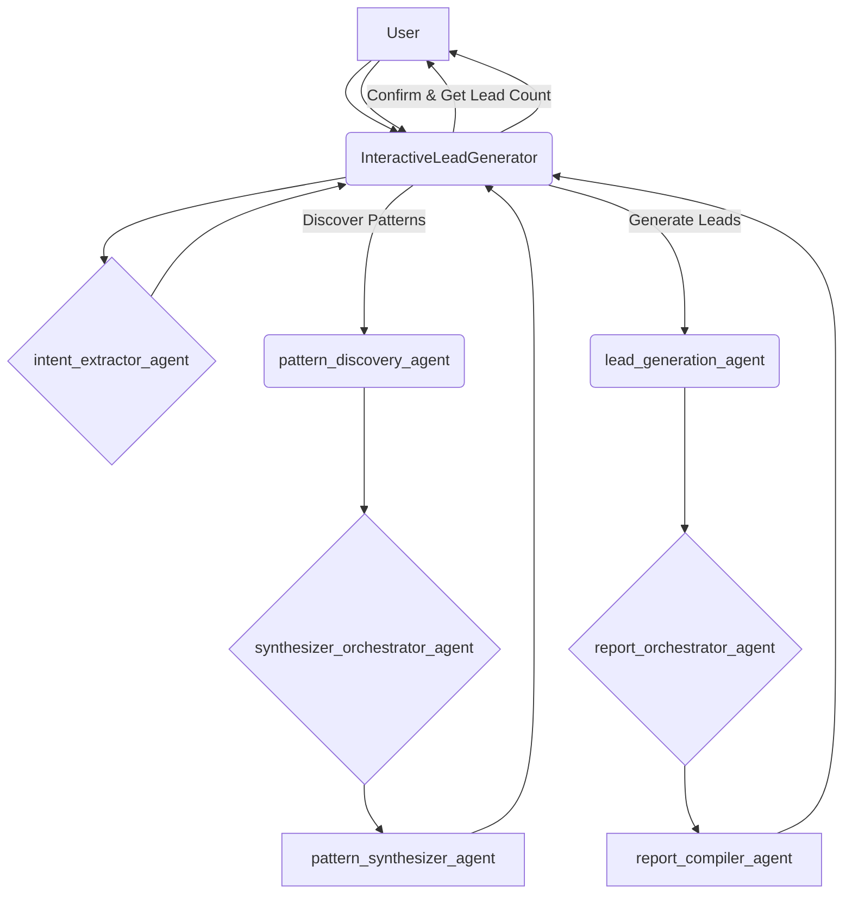

# 🚀 Interactive Lead Generation Agent (Google ADK + Vertex AI)

Agentic, multi-step workflow that discovers **pre-investment patterns** from successful companies and then finds **new leads** exhibiting those signals. Built with **Google Agent Development Kit (ADK)** and deployable to **Agent Engine / AgentSpace**.

---

## ✨ What it does

1. **Intent → Scope**  
   Parse a request like *“Find fintech leads in Thailand.”* Extract **country** and **industry**, then ask how many companies to analyze.

2. **Pattern Discovery (Learning)**  
   Find recent successful companies, validate, collect **pre-investment signals** (e.g., *hiring spree, local partnerships, regulatory sandbox*), and synthesize **common patterns**.

3. **Lead Generation (Prediction)**  
   Use the approved patterns to search for **new companies** showing similar signals, score them, and compile a **lead report** with sources.

---

## 🎥 Demo Video

Watch the full walkthrough of the Interactive Lead Generation Agent:

👉 **https://youtu.be/pBN0FHsu1qM**

---

## 🧱 Architecture


## 📁 Project Structure

```
LeadGenerationResearch/
├─ src/
│  ├─ app/
│  │  ├─ orchestrator.py      # Root agent
│  │  ├─ router.py            # Conversation routing
│  │  ├─ state.py             # Session state model
│  │  └─ config.py            # Env settings
│  ├─ agents/                 # Sub-agents (stubs -> extend)
│  ├─ tools/                  # Research & parsing utilities
│  └─ main.py                 # HTTP server entry (serve)
├─ artifacts/
│  ├─ patterns/               # synthesized pattern JSONs
│  ├─ leads/                  # raw leads, enrichment
│  └─ reports/                # final markdown/CSV reports
├─ deployment/
│  ├─ deploy.py               # create/list/delete Agent Engine
│  └─ test_deploy.py          # quick remote chat test
├─ publish/
│  └─ publish.sh              # publish to AgentSpace
├─ .env_example               # copy to .env and edit
├─ pyproject.toml
└─ README.md
```
## 🔧 Prerequisites

- Python 3.9 – 3.12 (Cloud Shell ships with 3.12)

- Google Cloud project with Vertex AI enabled

- gcloud CLI authenticated (Cloud Shell is pre-auth’d)

- Poetry for dependency management

## ⚙️ Environment Variables

Copy and edit:

```
cp .env_example .env
```
.env:
```
GOOGLE_CLOUD_PROJECT="your-project-id"
GOOGLE_CLOUD_LOCATION="us-central1"
GOOGLE_GENAI_USE_VERTEXAI="True"
GOOGLE_CLOUD_STORAGE_BUCKET="your-bucket"

GEN_FAST_MODEL="gemini-2.0-flash"
GEN_ADVANCED_MODEL="gemini-2.5-pro"

REASONING_ENGINE_ID=""    # filled after deploy.py --create
AGENT_SPACE_ID=""         # filled after creating AgentSpace app
```

## 📦 Install
Important: Ensure pyproject.toml has a Python range compatible with your VM:
```
[tool.poetry.dependencies]
python = ">=3.9,<4.0"
```
```
pip install -U pip poetry
poetry env remove --all || true
rm -f poetry.lock

poetry install

# Calm the resolver if needed (Spanner -> grpc-interceptor)
poetry add "grpc-interceptor==0.15.4" "google-cloud-spanner<3.59.0" "google-adk>=1.18,<2.0"
poetry add python-dotenv pydantic rich httpx beautifulsoup4 tenacity duckduckgo-search pandas
```
## ▶️ Run Locally (CLI)

From LeadGenerationResearch/:

```
poetry run adk run .
```
### Example session:
```
user> Find fintech leads in Thailand
agent> How many companies should I analyze? (1–10)
user> 3
agent> [shows patterns] Proceed?
user> yes
agent> How many leads? (1–10)
user> 5
agent> [prints Lead Report with signals + sources]
```

## ☁️ Deploy to Agent Engine
```
poetry run python deployment/deploy.py --create

```
## Test the deployed agent

```
poetry run python deployment/test_deploy.py

```
## 🧪 Sample Prompts

- “Find fintech leads in Thailand.”

- “Analyze renewable energy investors in Vietnam, then find 5 leads.”

- “Show sources for lead #2.”

- “Export the report to CSV.”


